# Docker


- **Docker** is a platform for developing, shipping, and running applications inside lightweight, portable containers.

- **Containers** package an application and its dependencies together, ensuring that it runs consistently across different environments (development, testing, production, etc.).

## How Docker Works (Basic Architecture)

Docker consists of:

- Docker Engine – Runs and manages containers
- Docker Images – Read-only templates for creating containers
- Docker Containers – Running instances of Docker images
- Docker Hub – Cloud-based registry for sharing images

**Docker images** is a file in the template formate is a set of instructions used to create a docker container in a read only format.

**Advantages** of using docker container is lightweight,fast delivery,reduce infrastructure cost,Easy Scalability.

### To run Docker without root privileges

https://docs.docker.com/engine/install/linux-postinstall/

1.Create the docker group.
```
sudo groupadd docker
```
2.Add your user to the docker group.
```
sudo usermod -aG docker $USER
```
3.You can also run the following command to activate the changes to groups.
```
newgrp docker
```

## **Docker Commands :**

### Commands for Docker containers

- Run a container from an image.
```
docker run --name <container name><image name>
```
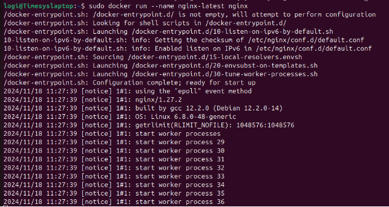

- Run a container in detached mode
```
docker run -d --name <container name><image name>.
```


- Run a container with ports
```
docker run -d -p  <port on host>:<port on container> --name <container name><image name>
```
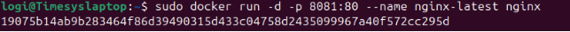

- List all running containers
```
docker ps
```
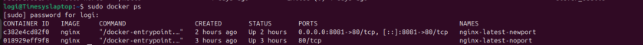

- List all containers,including stopped ones.
```
docker ps -a
```
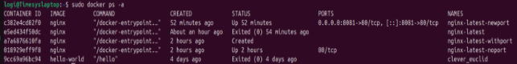

- Stop a running container.
```
docker stop <container name>
```


- start a stopped container
```
docker start<container name>
```


- Remove a stopped container
```
docker rm <container name>
```
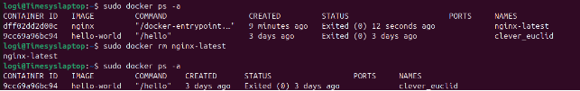

- Restart a running container
```
docker restart <container name>
```
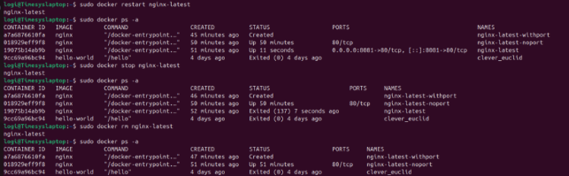

- Execute a command inside a running container.
```
docker exec -it <container_id_or_name> <command bin/bash>
```
**Example**:To check log inside the container: **docker exec -it <container-name> cat /app/logs.txt**
            
-  Check running processes inside the container: **docker exec -it <container-name> ps aux**

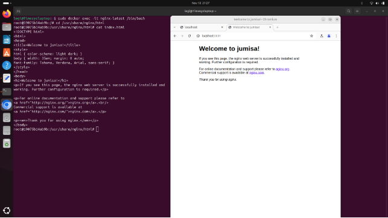

- view logs of the container
```
docker logs <container name>
```
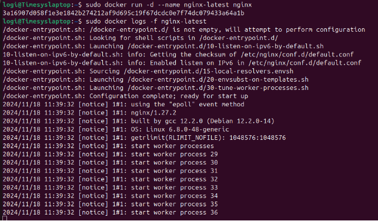

- Get detailed information about a container.
```
docker inspect <container name>
```
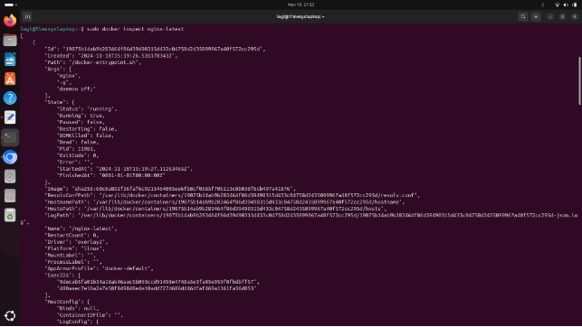

### Commands for Docker images

- Download a image from registry
```
docker pull image name
```
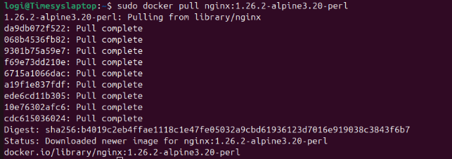

- List all downloaded images
```
docker images
```
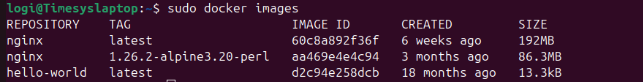

### Commands for System management

- show docker disk usage
```
docker system df
```
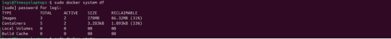

- Display realtime sats of runing containers.
```
docker stats
```
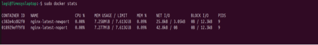

- Display docker system-wide information
```
docker info
```
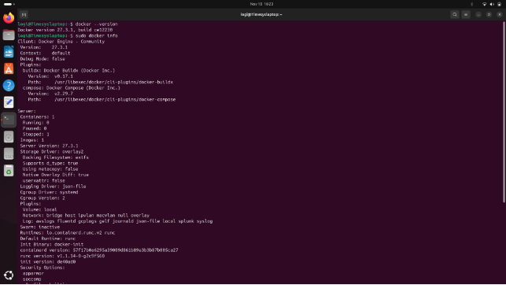

### Create a Docker file

**Step1:** Create a index.html file

mkdir ranjitha ---> cd ranjitha ----> sudo vi index.html

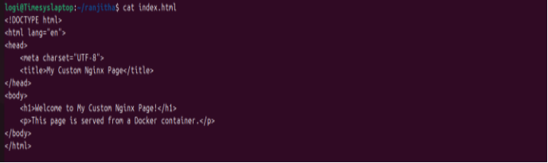

**Step2:** Create a Dockerfile

sudo vi Dockerfile

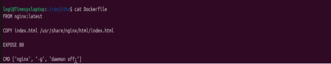

**Step3:** Build Docker image

Run the following command in the directory containing your Dockerfile.
```
docker build -t my-nginx-image .
```
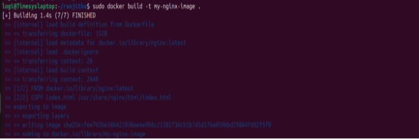

**Step4:** Run Custom NGINX Container

Start a container from your custom image
```
docker run --name my-custom-nginx1 -p 8082:80 -d my-nginx-imag
```

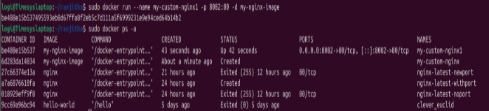


**Step5:** Check web server

localhost:8082

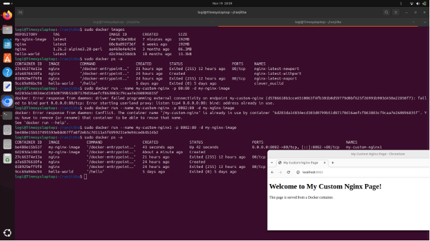

### Commands for Networks

- List all docker networks
```
docker network ls 
```
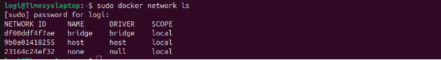

- logging into the container1
```
docker exec -it <container1>/bin/bash
```
- Check networks and ip address of container1

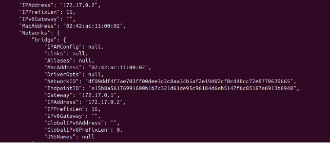

- Logging into container2
```
docker exec -it <container2>/bin/bash
```
- Check networks and ip address of container2

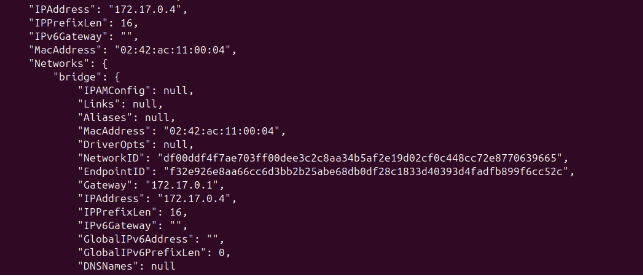

- To check network connection for container2
```
docker exex -it <container1>/bin/bash:    <ping container2 ip address within the container1>
```
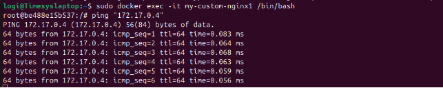
