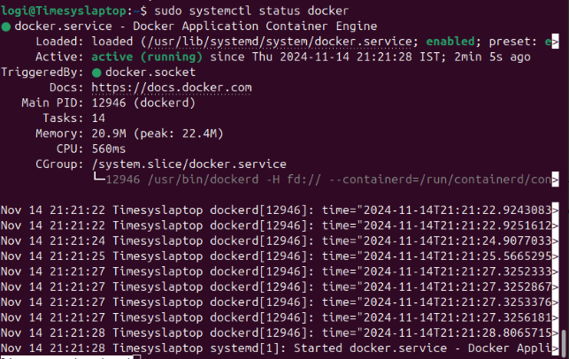
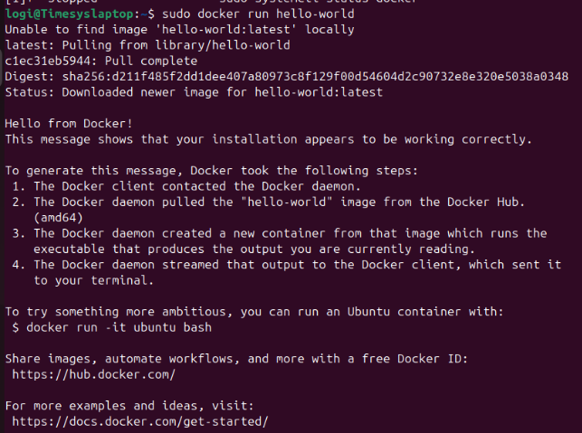

# Installation of Docker

**Step1:Update the System**
```
sudo apt update
```
**Step2:Install Required Dependencies**

Install a few prerequisite packages that allow apt to use packages over HTTPS
```
sudo apt install apt-transport-https ca-certificates curl software-properties-common -y
```
**Step3: Create a Keyring Directory**

Create a directory for storing GPG keys if it doesn't already exist
```
sudo mkdir -p /etc/apt/keyrings
```
**Step4:Download and Store the GPG Key**

Use curl to download the Docker GPG key and store it in a keyring file
```
curl -fsSL https://download.docker.com/linux/ubuntu/gpg | gpg --dearmor | sudo tee /etc/apt/keyrings/docker.gpg > /dev/null
```
**Step5:Set Up the Docker Repository**

Add the Docker repository to your system's sources list
```
echo "deb [arch=amd64 signed-by=/etc/apt/keyrings/docker.gpg] https://download.docker.com/linux/ubuntu $(lsb\_release -cs) stable" | sudo tee /etc/apt/sources.list.d/docker.list > /dev/null
```
**Step6**: **Update Package Index:**

After setting up the key and repository, update your package index
```
sudo apt update
```
**Step7:Install Docker**

Now, install Docker Engine and related components
```
sudo apt install docker-ce docker-ce-cli containerd.io docker-buildx-plugin docker-compose-plugin
```
**Step8:Verify Docker version**

To ensure that Docker was installed correctly, check its version:
```
docker --version
```


**Step9:Verify Installation**

Check if Docker is running properly by executing
```
sudo systemctl status docker
```


**Step10:Run a Test Container**

To confirm that Docker is functioning properly, run a test container
```
sudo docker run hello-world
```
**Explanation of Output**

Hello from Docker!: This confirms that your Docker installation is functioning properly.

Steps Taken: The output describes how Docker works behind the scenes, including pulling the image and running it.

Next Steps: It provides suggestions for further exploration with Docker.


